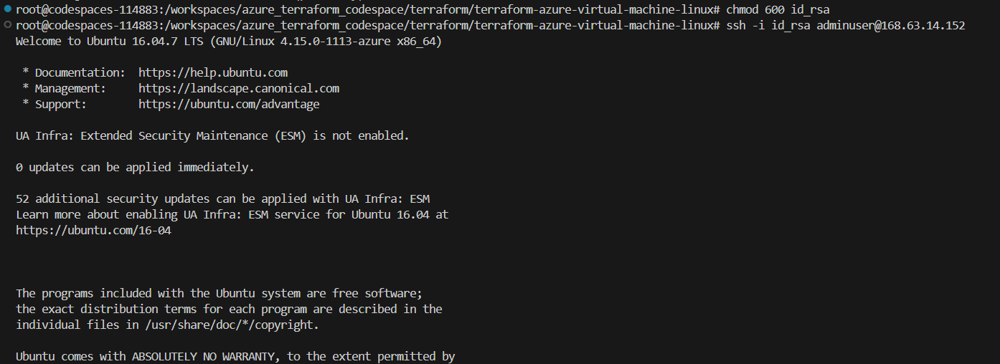

# Terraform configuration for deploying a Linux (Ubuntu) virtual machine on Azure

## Create a public/private key pair

In the same directory as your .tf files are located, run

``` terraform
  ssh-keygen -f id_rsa
```
Skip the passphrase.

## Deployment of the virtual machine using Terraform

Conduct the initialization with the following command:

``` terraform
  terraform init
```
Make sure your Terraform configuration files are in the desired format, by using:

``` terraform
terraform fmt
```

Validate your Terraform configuration

``` terraform
terraform validate
```

Create a Terraform plan by running:

``` terraform
terraform plan -out tfplan
```

Deploy the Ubuntu VM on Azure executing:

``` terraform
terraform apply tfplan
```

## Access the virtual machine

Ensure the proper permission for the private key:

``` bash
chmod 600 id_rsa
```

Establish a connection to the virtual machine using:

``` bash
ssh -i id_rsa adminuser@<public ip address>
```

<p align="left">
  
</p>

## Destruction of the virtual machine using Terraform

Destroy the Ubuntu VM on Azure executing:

``` terraform
terraform destroy
```